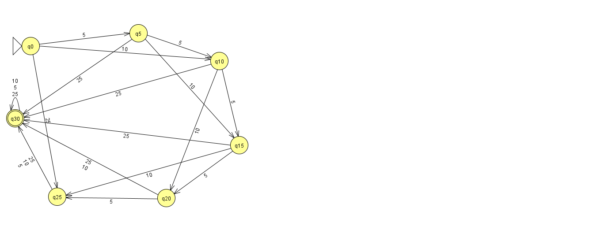

# Vending Machine

Interface web desenvolvida para o **Trabalho 01** da disciplina de Linguagens Formais e Autômatos. O projeto modela e implementa um **Autômato Finito Determinístico (AFD)** que simula o funcionamento de uma máquina de vendas, incluindo devolução de troco e escolha entre diferentes produtos.

🔗 **Teste online:** `https://alekcorrea.github.io/vending-machine-trabalho01/`

---

## Autores

- `Alessandra Corrêa`
- `Célia Raizer`

Disciplina: Linguagens Formais e Autômatos — Trabalho 01

---

## Enunciado do problema

Modelar uma vending machine que:
- Aceita moedas de **5, 10 e 25 centavos**;
- Vende um produto de **30 centavos**;
- Parte do **estado inicial (0)**;
- Reconhece sequências de moedas que levem a um **estado final** (valor inserido ≥ 30 centavos).

---

## Modelagem formal do AFD

O autômato foi modelado como uma **5-upla** `(Q, Σ, δ, q0, F)`:

### Conjunto de estados (Q)
Cada estado representa o valor total, em centavos, já inserido na máquina:

```
Q = { 0, 5, 10, 15, 20, 25, 30 }
```

O estado `30` funciona como um **estado absorvente**: qualquer valor igual ou superior a 30 centavos é representado por ele — inserir mais moedas depois de já ter 30+ centavos mantém a máquina no mesmo estado (self-loop). Assim como no artigo de referência da disciplina, que limita seus estados em 55 centavos, o que importa para a máquina é "tenho o suficiente ou não", e não o valor exato acumulado além do preço do produto.

### Alfabeto de entrada (Σ)
```
Σ = { 5, 10, 25 }
```
Cada símbolo representa a inserção de uma moeda daquele valor (em centavos).

### Estado inicial (q0)
```
q0 = 0
```

### Estados finais (F)
```
F = { 30 }
```
Representa "valor acumulado ≥ 30 centavos", ou seja, crédito suficiente para liberar o produto.

### Função de transição (δ)

A função `δ: Q × Σ → Q` é **total e determinística** — para todo par (estado, moeda) existe exatamente um próximo estado definido:

| Estado | 5¢  | 10¢ | 25¢ |
|--------|-----|-----|-----|
| 0      | 5   | 10  | 25  |
| 5      | 10  | 15  | 30  |
| 10     | 15  | 20  | 30  |
| 15     | 20  | 25  | 30  |
| 20     | 25  | 30  | 30  |
| 25     | 30  | 30  | 30  |
| **30** | 30  | 30  | 30  |

Modelagem construída e validada na ferramenta **JFLAP** antes de ser implementada em código (veja `Jflap/trabalho1.jff`).



*Figura 1 — Autômato Finito Determinístico desenvolvido no JFLAP para a máquina de vendas.*

---

## Como o AFD foi implementado

Nenhuma biblioteca externa de autômatos foi utilizada — todo o comportamento foi implementado manualmente em JavaScript puro. A transição de estado é calculada em `script.js`:

```js
const PRICE = 30;
let amount = 0, state = 0;

function stateName(v){
  return v >= PRICE ? "q30" : `q${v}`;
}

function insertCoin(coin){
  const old = stateName(state);
  amount += coin;
  state = Math.min(amount, PRICE);   // aplica δ(estado, moeda)
  const next = stateName(state);
  // atualiza display, histórico e mensagens...
}
```

`Math.min(amount, PRICE)` implementa exatamente a tabela de transições acima, incluindo o comportamento absorvente do estado final: somar qualquer moeda a partir de 30 centavos mantém o estado em `q30`. Note que `amount` (o valor total inserido, usado para calcular o troco) continua sendo somado normalmente mesmo depois do estado atingir `q30` — é por isso que o histórico mostra transições `q30 → q30` caso o usuário insira moedas extras antes de comprar.

O aceite (chegar ao estado final) é verificado por `amount >= PRICE`, o que libera a escolha do produto e o botão de compra.

### Por que um AFD simples, e não uma Máquina de Mealy?

O artigo de referência da disciplina usa uma Máquina de Mealy, pois a máquina real descrita lá precisa registrar informações na fita de saída (valor do troco e produto escolhido dentro de categorias de preço diferentes). Neste trabalho, o enunciado pede apenas o reconhecimento de sequências que levem a um estado final (crédito ≥ 30 centavos) — todos os produtos têm o mesmo preço, então não há necessidade de codificar categorias na própria transição. Por isso, um AFD comum é suficiente para o autômato formal; o cálculo de troco e a escolha do produto ficam a cargo da interface, como uma camada de aplicação por cima do autômato.

---

## Interface e visualização das transições

Para tornar visíveis as transições do autômato ("como ver as transições de estado ocorrendo?"), a interface (`index.html` + `style.css`) segue o fluxo real de uma vending machine — moeda primeiro, produto depois:

1. **Insira uma moeda** (5¢, 10¢ ou 25¢): a cada clique, o valor acumulado e o estado atual (`q0` a `q30`) são atualizados.
2. A cada moeda inserida, o painel **"Transições do Autômato"** mostra:
   - a transição realizada, no formato `qX → qY`;
   - o valor da moeda e o valor acumulado;
   - um **histórico** com todas as transições da sessão, incluindo eventuais `q30 → q30` (self-loop) se moedas extras forem inseridas depois de atingido o valor mínimo.
3. **Escolha um produto** (Refrigerante, Chocolate ou Biscoito) — os botões só ficam habilitados quando o estado final (`q30`) é atingido.
4. **Comprar**: libera o produto e mostra o troco (valor inserido − 30 centavos), quando houver.
5. **Reiniciar**: zera o autômato de volta ao estado inicial `q0` para uma nova simulação.

---

## Estrutura de arquivos

```
├── index.html          # estrutura da interface (máquina + painel do autômato)
├── style.css            # visual da interface
├── script.js             # implementação do AFD e lógica da interface
├── README.md             # este arquivo
└── Jflap/
    ├── trabalho1.jff        # autômato modelado no JFLAP
    └── trabalho1.jff.png    # diagrama de estados exportado do JFLAP
```

---

## Casos de teste

| Sequência de moedas       | Valor final | Resultado esperado         |
|----------------------------|-------------|------------------------------|
| 5, 5, 5, 5, 5, 5            | 30¢         | Aceita — libera o produto |
| 25, 5                       | 30¢         | Aceita — libera o produto |
| 10, 10, 10                  | 30¢         | Aceita — libera o produto |
| 25, 25                      | 30¢ (50→30) | Aceita — libera o produto, troco de R$ 0,20 |
| 5, 5, 5, 5, 5                | 25¢         | Rejeita — não libera o produto |

---

## Como testar

**Localmente:** abra o arquivo `index.html` em qualquer navegador (não precisa de servidor nem instalação).

**No JFLAP:** abra `Jflap/trabalho1.jff` para ver e simular o autômato formal diretamente na ferramenta.